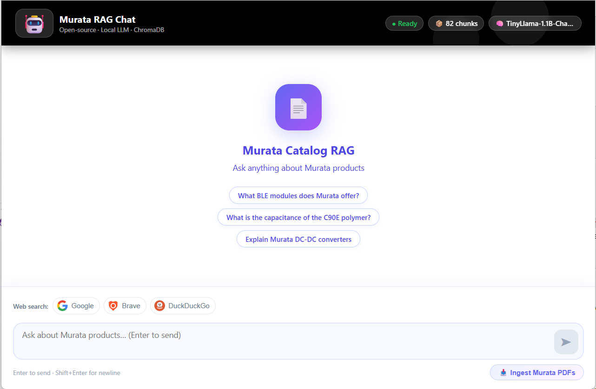

# Open Source RAG with MCP



A fully open-source Retrieval-Augmented Generation (RAG) system that ingests Murata product catalog PDFs, stores them in a local vector database, and answers questions through a chat UI — with optional web search via DuckDuckGo, Brave, or Google.

---

## Tech Stack

| Layer | Technology |
|-------|-----------|
| LLM | HuggingFace Transformers (TinyLlama-1.1B default) |
| Embeddings | sentence-transformers (all-MiniLM-L6-v2) |
| Vector DB | ChromaDB (local, persistent) |
| PDF parsing | pdfplumber + requests |
| Backend API | FastAPI + uvicorn |
| Frontend | React 18 + TypeScript + Vite |
| MCP Server | FastMCP (exposes tools to Claude Code) |
| Web Search | DuckDuckGo (free) / Brave / Google (API keys optional) |

---

## Architecture

```
PDF URLs
    ↓
ingestion/pdf_loader.py     download + extract text page by page
ingestion/chunker.py        split into overlapping word chunks
    ↓
embeddings/embedder.py      encode with sentence-transformers
    ↓
vector_store/chroma_store.py    store in ChromaDB (cosine similarity)
    ↓  (at query time)
retrieval/retriever.py      embed query → similarity search → top-K chunks
    +
mcp_server/search_tools.py  optional web search (DuckDuckGo / Brave / Google)
    ↓
llm/hf_client.py            combine context → generate answer with TinyLlama
    ↓
api/server.py (FastAPI)     serve results to the browser
frontend/src/               React chat UI
```

---

## Development Steps

### Step 1 — Project scaffold

Created the base Python package structure with one module per concern:

```
config.py           central settings loaded from .env
ingestion/          PDF download + chunking
embeddings/         sentence-transformers wrapper
vector_store/       ChromaDB wrapper
retrieval/          similarity search + context formatting
llm/                LLM client
rag/                pipeline orchestrator
tests/              pytest unit tests
```

### Step 2 — PDF ingestion (`ingestion/`)

- `pdf_loader.py`: downloads PDFs from URLs using `requests`, extracts text page-by-page with `pdfplumber`
- `chunker.py`: splits page text into fixed-size word windows with configurable overlap (`CHUNK_SIZE`, `CHUNK_OVERLAP` env vars)
- Input: 4 Murata catalog PDF URLs (BLE guide, overview, polymer capacitor, DC-DC power)

### Step 3 — Embeddings (`embeddings/`)

- `embedder.py`: wraps `sentence-transformers` (`all-MiniLM-L6-v2`) to produce 384-dimensional vectors
- Chosen because it is fully open-source, runs locally with no API key, and is fast on CPU

### Step 4 — Vector store (`vector_store/`)

- `chroma_store.py`: persists embeddings in ChromaDB with cosine distance
- Chunk IDs are MD5 hashes of content + metadata → re-ingesting the same PDF is idempotent (no duplicates)
- Retrieval score reported as `1 - cosine_distance` (higher = more similar)

### Step 5 — LLM (`llm/`)

- Initially designed for Ollama, then switched to HuggingFace `transformers` so no separate server is needed
- `hf_client.py`: loads any causal LM from the HuggingFace Hub via `pipeline("text-generation")`
- Default model: `TinyLlama/TinyLlama-1.1B-Chat-v1.0` (~600 MB, runs on CPU)
- Uses the model's chat template when available; falls back to a plain prompt otherwise
- System prompt instructs the model to answer only from provided context and cite page numbers

### Step 6 — RAG pipeline (`rag/`)

- `pipeline.py`: `RAGPipeline` class wires all layers together
- `ingest_urls()`: download → chunk → embed → store (batched)
- `query()`: embed query → retrieve top-K chunks → format context → generate answer
- Returns `answer`, `sources`, and `hits` (with similarity scores)

### Step 7 — FastAPI backend (`api/`)

- `server.py`: REST API with three endpoints:
  - `GET /api/status` — model name, chunk count, ready flag
  - `POST /api/chat` — accepts `{question, engine}`, returns answer + sources + web results
  - `POST /api/ingest` — triggers PDF ingestion
- All LLM/embedding calls run in a thread executor so they don't block the async event loop
- CORS enabled for the Vite dev server (`localhost:5173`)

### Step 8 — MCP server (`mcp_server/`)

- `search_tools.py`: shared search logic for DuckDuckGo (free), Brave (API key), Google (API key + CSE ID)
- `server.py`: FastMCP server exposing four tools — `duckduckgo_search`, `brave_search`, `google_search`, `rag_search`
- Can be registered with Claude Code so the AI assistant can call these tools directly:
  ```bash
  claude mcp add rag-search -- python -m mcp_server.server
  ```

### Step 9 — React frontend (`frontend/`)

Built with Vite + React 18 + TypeScript:

- `App.tsx`: manages state (messages, loading, status), polls `/api/status` every 5 seconds
- `ChatWindow.tsx`: scrollable message list with auto-scroll
- `MessageBubble.tsx`: user/assistant bubbles with web result links and PDF source chips
- `InputBar.tsx`: textarea (Enter to send, Shift+Enter for newline) + ingest button
- `SearchEngineBar.tsx`: Google / Brave / DuckDuckGo toggle icons — selecting one adds web search context to the RAG answer
- Vite proxy forwards `/api/*` to FastAPI on port 8000, so no CORS issues in development

---

## Getting Started

### Prerequisites

- Python 3.10+
- Node.js 18+
- (Optional) NVIDIA GPU for faster inference

### 1. Clone and install Python dependencies

```bash
git clone <repo-url>
cd Open_Source_RAG
python -m venv .venv
.venv\Scripts\activate        # Windows
# source .venv/bin/activate   # macOS/Linux
pip install -r requirements.txt
```

### 2. Configure environment

```bash
copy .env.example .env        # Windows
# cp .env.example .env        # macOS/Linux
```

Edit `.env` — key settings:

```env
HF_MODEL=TinyLlama/TinyLlama-1.1B-Chat-v1.0
HF_MAX_NEW_TOKENS=128          # lower = faster responses
HF_DEVICE=cpu                  # set to "cuda" if you have a GPU
BRAVE_API_KEY=                 # optional
GOOGLE_API_KEY=                # optional
GOOGLE_CSE_ID=                 # optional
```

### 3. Start the backend

```bash
uvicorn api.server:app --reload
```

The model downloads automatically from HuggingFace on first run (~600 MB). Wait for:
```
INFO: Application startup complete.
```

Verify at: `http://localhost:8000/api/status`

### 4. Start the frontend

```bash
cd frontend
npm install      # first time only
npm run dev
```

Open [http://localhost:5173](http://localhost:5173) in your browser.

### 5. Ingest the Murata catalogs

Click **📥 Ingest Murata PDFs** in the UI (or run `python main.py ingest`). The header will update the chunk count when done.

### 6. Ask questions

Type a question and press Enter. Optionally click a search engine icon to augment answers with live web results.

---

## Performance Tips

| Situation | Fix |
|-----------|-----|
| Slow responses on CPU | Set `HF_MAX_NEW_TOKENS=128` in `.env` |
| Want faster model | Set `HF_MODEL=facebook/opt-125m` |
| Have NVIDIA GPU | Set `HF_DEVICE=cuda` |
| Want better quality | Set `HF_MODEL=mistralai/Mistral-7B-Instruct-v0.3` (needs 16 GB RAM) |

---

## Running Tests

```bash
pytest
pytest tests/test_rag.py -v    # single file
```

## Project Structure

```
Open_Source_RAG/
├── config.py               central config (reads .env)
├── main.py                 CLI entry point
├── requirements.txt
├── .env.example
├── ingestion/
│   ├── pdf_loader.py       download + parse PDFs
│   └── chunker.py          word-level chunking with overlap
├── embeddings/
│   └── embedder.py         sentence-transformers wrapper
├── vector_store/
│   └── chroma_store.py     ChromaDB (cosine, persistent)
├── retrieval/
│   └── retriever.py        similarity search + context formatting
├── llm/
│   └── hf_client.py        HuggingFace Transformers LLM
├── rag/
│   └── pipeline.py         RAGPipeline orchestrator
├── api/
│   └── server.py           FastAPI (REST API for the UI)
├── mcp_server/
│   ├── search_tools.py     DuckDuckGo / Brave / Google search
│   └── server.py           FastMCP server (tools for Claude Code)
├── frontend/               React + TypeScript chat UI
│   └── src/
│       ├── App.tsx
│       ├── types.ts
│       └── components/
│           ├── ChatWindow.tsx
│           ├── MessageBubble.tsx
│           ├── InputBar.tsx
│           └── SearchEngineBar.tsx
└── tests/
    ├── test_ingestion.py
    ├── test_embeddings.py
    ├── test_vector_store.py
    └── test_rag.py
```
